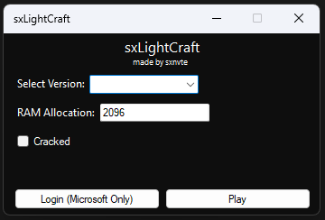

# sxLightCraft | Canary Build
A simple, open source and lightweight Minecraft Launcher
Canary build gives the fresh look and features but it may be unstable

# How to build Canary Build

Note: Use Visual Studio 2022 to compile that branch.

1. Clone the branch `git clone --single-branch --branch canary https://github.com/sxnvte/sxLightCraft.git`
2. Next to the Start button on top of your screen click on Debug and change it to Release 
3. Now you can press start to start launcher and build it or press CTRL + Shift + B
4. enjoy!

# Requriments
- .NET Framework 4.7.2
- Java
- Bought Minecraft (optional but recommended!!!)

# Credits
- [AlphaBs](https://github.com/AlphaBs) for making CmlLib 
- [Me!](https://github.com/sxnvte) for making the GUI and everything except CmlLib
